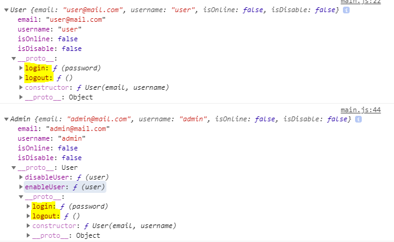

# JavaScript Prototypal Inheritance Example
In this simple example `User` and `Admin` classes are created, where `Admin` class inherits `User` class using prototypes in JavaScript.

## Run
To run the code just open the [index.html](index.html) file in the browser. Then inspect the page and see the output on the console.

